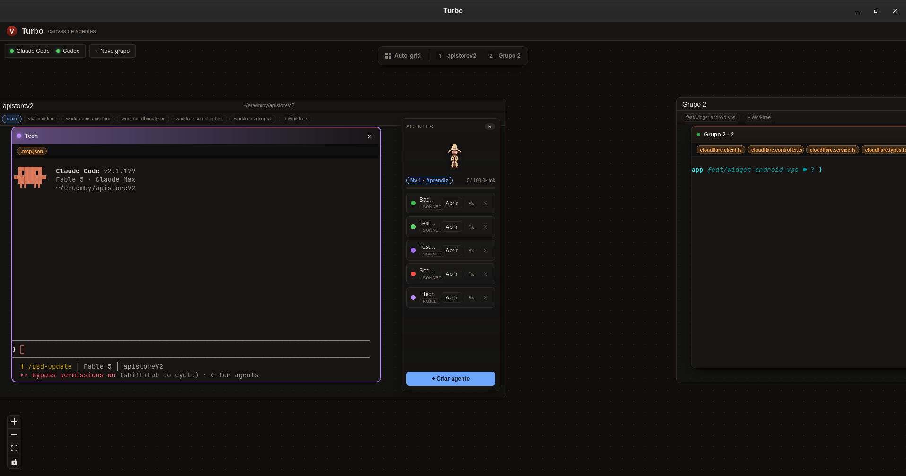
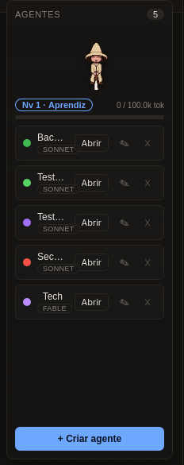

<div align="center">


# Turbo — Canvas de Agentes

Um cockpit visual pessoal: um canvas infinito estilo Figma onde cada nó é um
**terminal ao vivo** rodando `claude` (ou `codex`). Um Claude "pai" orquestra e
seus subagentes, em vez de rodarem escondidos, aparecem como **novos terminais
visíveis no canvas**, executando em tempo real.

Ferramenta pessoal do vings — Linux/Wayland/Hyprland.

</div>



## Features

- **Canvas infinito de terminais** — pan/zoom estilo Figma (`@xyflow/react`); cada
  nó é um `@xterm/xterm` real, com PTY ao vivo no Rust. Digitar, redimensionar e
  fechar funcionam como um terminal de verdade.
- **Grupos = projetos** — cada grupo tem um `cwd` próprio e uma equipe de agentes.
  Vários grupos rodam lado a lado; abas no topo e **Auto-grid** (Ctrl+G) organizam
  o canvas.
- **Agentes salvos por projeto** — defina nome, modelo (Fable/Opus/Sonnet/Haiku/
  Codex), cor e o **system prompt** (instruções). Presets prontos (Orquestrador,
  Backend, Frontend, Segurança, Testes) e formulário custom. "Abrir" sobe o
  terminal do agente sob demanda.
- **Editar instruções do agente** — o lápis (✎) em cada agente reabre o formulário
  pré-preenchido para ajustar nome, modelo, cor e o system prompt a qualquer
  momento.
- **Orquestração via MCP** — servidor MCP embutido no app expõe a tool
  `spawn_agent`; o Claude pai dispara filhos que nascem como terminais no canvas,
  com aresta pai→filho, e devolvem o resultado de volta.
- **Worktrees como raias** — cada grupo detecta os git worktrees do repo e mostra
  um chip por worktree; clicar abre um subgrupo dedicado cujo `cwd` é a worktree,
  então os terminais rodam isolados naquela branch. "+ Worktree" cria uma nova.
- **Mascote de nível** — um mago pixel que evolui conforme o projeto gasta tokens
  (Aprendiz → Feiticeiro → Arquimago → Cavaleiro Arcano → Deus Arcano), com toast
  de level-up e barra de progresso.
- **Uso de tokens e custo** — cada terminal reporta tokens e custo estimado da
  sessão; o grupo soma o total do projeto.
- **Artefatos clicáveis** — arquivos alterados por um agente viram chips que abrem
  um viewer do conteúdo no próprio canvas.
- **Auto-update** — atualização automática via Tauri updater a partir dos GitHub
  Releases.

<div align="center">

</div>

## Stack

- **Tauri v2** (core Rust) + **React 19 + TypeScript** (Vite)
- **Canvas**: `@xyflow/react` com custom nodes
- **Terminal**: `@xterm/xterm`
- **PTY**: `portable-pty` no Rust, streaming de bytes para o webview via Tauri `Channel`
- **MCP**: `rmcp` (servidor streamable HTTP embutido) expondo `spawn_agent`
- **Estado**: Zustand (persistido em localStorage)

## Rodar (dev)

```bash
cd app
npm install          # primeira vez
npm run tauri dev    # compila o Rust, sobe o Vite e abre a janela
```

O fix de janela preta no Wayland/Hyprland (`WEBKIT_DISABLE_DMABUF_RENDERER=1`) já é
aplicado no backend — não precisa exportar nada à mão.

## Build

```bash
cd app
npm run tauri build  # binário de release (.AppImage / .deb)
```

## Instalar (release)

Baixe o instalador da última versão em
**[Releases](https://github.com/Onlybielzin/turbo/releases/latest)**:

- **Arch/Omarchy e afins**: use o `.AppImage` (`chmod +x` e execute).
- **Debian/Ubuntu**: use o `.deb`.

## Publicar uma versão

Os builds são feitos no CI (GitHub Actions). Um push de tag `v*` dispara
`.github/workflows/release.yml`, que builda no Linux e publica os instaladores.
Use o skill `/publish` para o bump sincronizado de versão nos três arquivos
(`app/package.json`, `app/src-tauri/tauri.conf.json`, `app/src-tauri/Cargo.toml`),
commit, tag e push.

## Layout

```
app/                     # app Tauri + React
  src/canvas/            # front do canvas (store, GroupFrame, TerminalNode, agentes, mascote)
  src-tauri/             # backend Rust (PTY manager, MCP server, groups, worktrees)
docs/screenshots/        # imagens do README
.planning/               # docs GSD: PROJECT, REQUIREMENTS, ROADMAP, research, phases/
```
